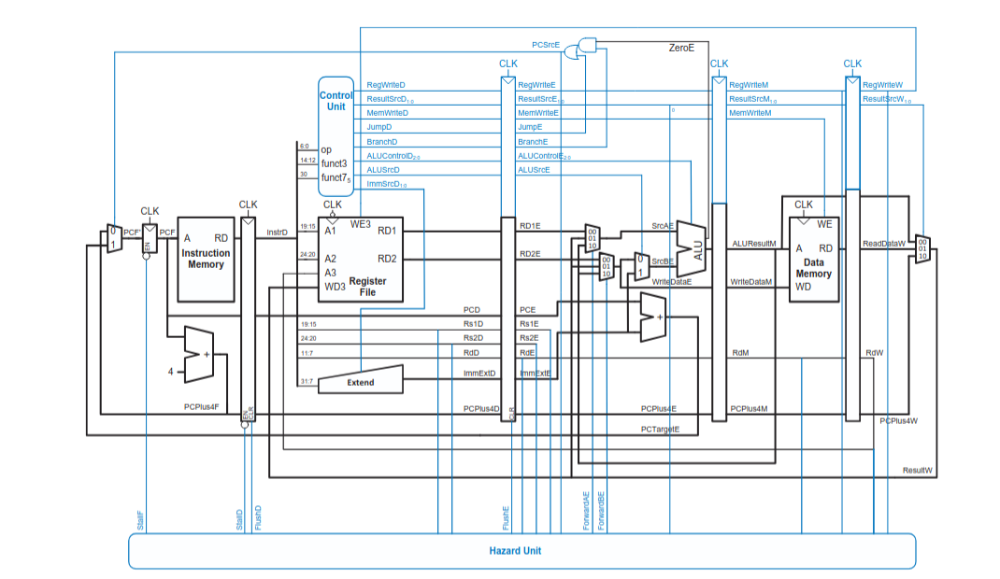
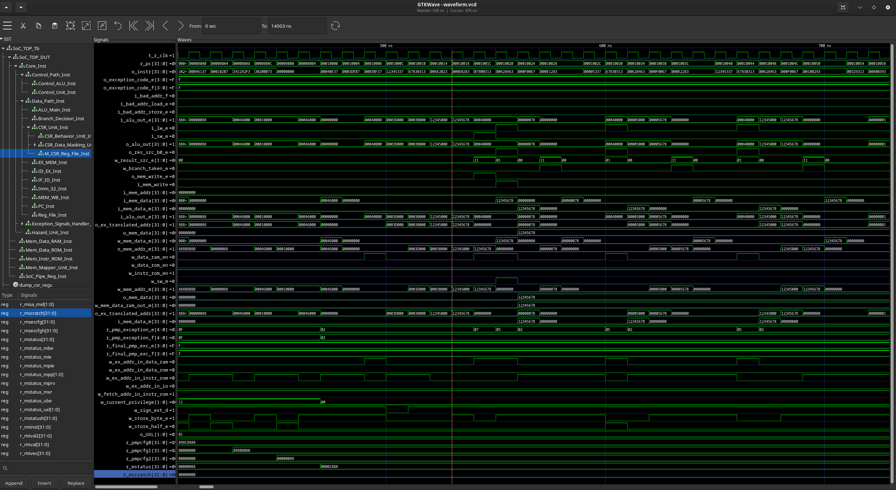

# RISC-V Minimal SoC
Implementation of a RISC-V softcore connected with parameterized memory modules and a memory mapper unit. The execution of instructions is divided in 5 distinct stages, each one taking exactly one clock cycle.<br>
**The 5 stages are:**<br>
-> Instruction Fetch (IF)<br>
-> Instruction Decode (ID)<br>
-> Instruction Execution (EX)<br>
-> Memory access (M)<br>
-> Write-Back (WB)<br>

**Supported Instructions:**<br>
-> R type: add, sub, or, and, slt, sltu<br>
-> I type: addi, lw, lb, lh, lbu, lhu, jalr<br>
-> J type: jal<br>
-> S type: sw, sh, sb<br>
-> B type: beq, bne, blt, bge, bltu, bgeu<br>
-> U type: lui, auipc<br>
-> I type zicsr: csrrw, csrrs, csrrc, csrrwi(WIP), csrrsi(WIP), csrrci(WIP)<br>
And the rest of the rv32i base instruction set.<br>

# Memory

-> Harvard architecture<br>
-> Three Memory modules: Instruction ROM, Data ROM, Data RAM<br>
-> The Data ROM is used for load data, which in the Reset Vector should be copied into RAM<br>
-> 2MiB total<br>
-> 256KiB ROM (instruction memory and data ROM), 32KiB RAM (global data, dynamic, stack, machine stack), 8KiB IO<br>
-> Memory restrictions are imposed by hardware (in order to prevent data access into the instruction ROM), and physical memory segments access permissions are imposed through the Physical Memory Protection (PMP) CSR registers<br>

**Memory:**<br>

## RAM

| Region       | Access | High Addr   | Low Addr    | Size  |
|--------------|--------|-------------|-------------|-------|
| IO           | ---    | 0x0004_9FFF | 0x0004_8000 | 8 KiB |
| M_STACK      | ---    | 0x0004_7FFF | 0x0004_6000 | 8 KiB |
| STACK        | RW-    | 0x0004_5FFF | 0x0004_4000 | 8 KiB |
| DYNAMIC      | RW-    | 0x0004_3FFF | 0x0004_2000 | 8 KiB |
| GLB_DATA     | RW-    | 0x0004_1FFF | 0x0004_0000 | 8 KiB |

## ROM

| Region       | Access | High Addr   | Low Addr    | Size    |
|--------------|--------|-------------|-------------|---------|
| ROM_DATA     | R--    | 0x0003_FFFF | 0x0003_E000 | 8 KiB   |
| TEXT         | --X    | 0x0003_DFFF | 0x0001_0000 | 184 KiB |
| RESET        | ---    | 0x0000_FFFF | 0x0000_8000 | 32 KiB  |
| TRAP         | ---    | 0x0000_7FFF | 0x0000_0000 | 32 KiB  |

-> PMP registers are written in M mode, in the reset vector<br>
-> The restrictions imposed through PMP are only available for U-mode code<br>
-> M mode code will still be enforced by the Memory Mapper Unit, which can detect access into the Instruction ROM module<br>
-> Current implementation allows for NAPOT, NA4 and TOR pmpcfg/pmpaddr configs. (TOR is used in the sample code)<br>

### Implementation Details

The 5 stage pipeline structure is defined by the 4 stage-dividing registers, which store relevant data between clock cycles. In the diagram presented here, the data path is represented with black, and the various control signals that define the execution of certain instructions is represented with blue.<br>
This diagram only represents the baseline of the project.<br>
A benefit of the pipelined architecture is that multiple instructions are executed simultaneously. At the same time, hazards can occur, causing incorrect program execution. The Hazard Unit, based on information that is already present in the pipeline, can detect these occurances. <br> <br>
**Some relevant hazards are:** <br>
-> Data Hazards (Read after Write, register use immediately after lw):<br>
**Forward if:**<br>
    1. A source register in execute-stage is the same as the destination register in memory-stage/decode-stage. (non csr)<br>
    2. A source register in decode-stage is the same as the destination register in write-back-stage (non csr)<br>
    3. The instruction in memory-stage/write-back-stage is csr-type and a source register in execute-stage is the same as the destination register in mem/wb (csr followed by normal)<br>
    4. The instruction in decode is csr-type and the instruction in ex/mem/wb is not csr and the source register in ex/mem/wb is the same as the destination in ex/mem/wb (normal followed by csr)<br>
    5. The instruction in ex/mem/wb is csr and the instruction in decode is csr, and the imm field in decode is the same as the imm field in ex/mem/wb (csr followed by csr)<br>
    6. The instruction in em/mem/wb is csr and the instruction in decode is csr, and the source register in decode is the same as the destination in ex/mem/wb (csr followed by csr)<br>
   Extra forwards are needed for csr type instructions because they don't fully share the same path with regular rv32i instructions (Different register file and 2 register writes).<br>
**Stall if:**<br>
    1. The instruction in execute takes data from memory, and the destination register in execute is the same as the source register in decode. This stalls the IF_ID register and the PC, inserting a bubble for one clock cycle.<br>
    2. An exception is detected in the fetch stage: IF_ID stall, because the opcode of the faulting instruction has to be in decode in order to decide new permissions.<br>
**Flush if:**<br>
    1. A load bubble was introduced (Flush ID_EX to prevent invalid data from propagating).<br>
    2. Mret instruction is in execute stage (Flush IF_ID and ID_EX to prevent the instructions in fetch and decode from executing).<br>
    3. A branch is taken or a j type instruction is in execute (Flush IF_ID and ID_EX)<br>
    4. An exception is detected in fetch and is now in decode (Flush IF_ID to clear the instruction that entered in fetch).<br>
    5. An exception is detected in execute and is now in mem-stage (Flush ID_EX and IF_ID).<br> <br>
-> Control Hazards (Not knowing whether a conditional branch is taken or not)<br>

**Detected Exceptions:** <br>
-> Fetch address misaligned (code 0) <br>
-> Illegal instruction (code 2) <br>
-> Sp out of range (code 3) <br>
-> Load address misalligned (code 4) <br>
-> Load access fault (code 5) <br>
-> Store address fault (code 6) <br>
-> Ecall (code 7) <br>
    Ecall uses the data in register a7 in order to execute a syscall. (WIP) <br>

**Exception Handling:** <br>
Upon detecting an exception the PC is updated to the beginning of the Trap Vector (addr 0x00000000 in rom instruction mem). Used registers are stored on the csr stack, and depending on the exception code found in the mcause register the code branches to the correct handler. After handling the exception the program either exits (goes into an infinite loop with no instructions) or returns to the value found in mepc (using mret).<br> <br>
-> Special csr registers:
1. mstatus lower <br>
2. mie <br>
3. mtvec <br>
4. mstatus upper <br>
5. mscratch <br>
6. mepc <br>
7. mcause <br>
8. mtval <br>
   
-> Entering the trap vector: <br>
1. mepc <= current PC <br>
2. mie <= 0 (interrupts disabled in trap vector **Interrupts are WIP**) <br>
3. mcause <= exception code (bit 31 = 1 for interrupt, 0 for exception) <br>
4. mtval <= additional exception info <br>
   
-> Exiting the trap vector: <br>
1. PC <= mepc
2. mie <= default interrupt permissions<br>

<br>

-> When entering an exception the current privilege level will be updated to MACHINE, the mstatus.mpp field will be updated to the previous privilege.<br>
-> When returning from an exception, the current privilege will be taken from mstatus.mpp.<br>
-> The CSR Data Masking Unit is used to enforce special read/write policies (such as WPRI and WARL), before the actual writing is done in WB stage, in order to forward correct information.<br>


### Testing

The code used for testing is written into the startup.s asm file. The memory regions are defined in the linker script. (WIP) <br>
The create_hex.sh script takes in as a parameter the name of the asm source (no .s extension), and generates the little endian hex dump file. (assembler -> linker -> objcopy -> hexdump) <br>
The run_one.sh script compiles the .v code into a .out intermediate simulation executable, which is then run by the vvp runtime to run the simulation.<br>
The code loaded into the Instruction Memory covers arithmetic, logical, branch and memory instructions. There are cases that trigger data hazards, control hazards, and exceptions.<br>
Testing was done using Icarus Verilog and GTKWave in Visual Studio Code.<br>


### Tools Needed and how to use
-> Icarus Verilog, GTKWave<br>
Debian/Ubuntu:
```bash
apt install iverilog
apt install gtkwave
```
RedHat/Fedora:
```bash
dnf install iverilog
dnf install gtkwave
```
-> On Windows: GTKWave: https://sourceforge.net/projects/gtkwave/files/ Icarus Verilog: https://bleyer.org/icarus/ <br>

-> GCC RISC-V Stack: https://github.com/riscv-collab/riscv-gnu-toolchain<br>
**Follow the instructions for Newlib**
<br>
<br>

-> In order to run verilog code:
```bash
iverilog -g2012 <all verilog files to compile>; vvp a.out;
```

-> In order to run the simulation
```bash
gtkwave waveform.vcd (or whatever simulation name is given in the testbench file)
```
<br>

-> In order to generate a hexfile
```bash
riscv64-unknown-elf-as -march=rv32i_zicsr -mabi=ilp32 -o <Output obj file> <.s File>
riscv64-unknown-elf-gcc -march=rv32i_zicsr -mabi=ilp32 -nostdlib -T <Linker File> <.o file> -o <Output .elf file>
riscv64-unknown-elf-objcopy -O binary <.elf file> <Output .bin file>
xxd -p -c 4 <.bin file> > <Output .hex file>
```

-> In the file riscv_defines the define DEBUG selects between manually written .mem files and loading from the generated .hex (the paths are specified in the included scripts)<br>


